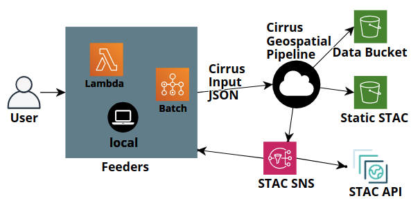

# Cirrus

Cirrus is a [STAC](https://stacspec.org/)-based processing pipeline. As input, Cirrus takes a GeoJSON FeatureCollection with 1 or more STAC Items. This input is run through workflows that generate 1 or more STAC Items as output. These output Items are added to the Cirrus static STAC catalog, and are also broadcast via an SNS topic that can be subscribed to for triggering additional workflows, such as keeping a dynamic STAC catalog up to date (for example, [STAC-server](https://github.com/stac-utils/stac-server)).

Cirrus workflows can be as simple as containing no processing at all, where the input is passed through and published. It could be more complex where the STAC Items and underlying data are transformed, and then those are published.  The current state (QUEUED, PROCESSING, COMPLETED, FAILED) is tracked during processing, preventing inputs from getting ingested more than once and allows for a user to follow the state of any input through the pipeline.



As shown in this high-level overview of Cirrus, users input data to Cirrus through the user of *feeders*. Feeders are simply programs that get/generate some type of STAC metadata, combine it with processing parameters and passes it into Cirrus in the format Cirrus expects.

Because Cirrus output is published via SNS, a Feeder can be configured to subscribe to that SNS and thus workflows can be chained, such that the output of one workflow becomes the input to another workflow and creates multiple levels of products, all with published STAC metadata and clear links showing data provenance.


## Cirrus Quickstart

A Cirrus project is managed via the `cirrus` cli tool. Here's everything required to create, modify, and deploy a new project:

```
# Make a new directory for a project
❯ mkdir cirrus-project; cd cirrus-project

# Create a python virtual environment for isolation
❯ python -m venv .venv

# Activate our venv
❯ . .venv/bin/activate

# Install cirrus-geo
❯ pip install cirrus-geo
...

# Now we should have cirrus on our path
❯ cirrus
Usage: cirrus [OPTIONS] COMMAND [ARGS]...

  cli for cirrus, a severless STAC-based processing pipeline

Options:
  --cirrus-dir DIRECTORY
  -v, --verbose           Increase logging level. Can be specified multiple
                          times.  [x>=0]
  --help                  Show this message and exit.

Commands:
  build             Build the cirrus configuration into a serverless.yml.
  clean             Remove all files from the cirrus build directory.
  create            Create a new component in the project.
  init              Initialize a cirrus project in DIRECTORY.
  serverless (sls)  Run serverless within the cirrus build directory.
  show              Multifunction command to list/show components,
                    component...

# Fantastic!
# We can init our new project and see what all was created
❯ cirrus init
Succesfully initialized project in '/Users/jkeifer/cirrus-project'.

❯ ls
.venv/	cirrus.yml  feeders/  functions/  outputs/  package.json  resources/  tasks/  workflows/

# The cirrus.yml is almost good to go for a minimal install,
# but it does require a few parameters either set in the
# config or as environment variables:
#
#   custom:
#     batch:
#       SecurityGroupIds:
#         - ${env:SECURITY_GROUP_1}
#       Subnets:
#         - ${env:SUBNET_1}
#         - ${env:SUBNET_2}
#         - ${env:SUBNET_3}
#         - ${env:SUBNET_4}
#
# Use your favorite editor to set these values approriately
# based on your existing AWS resources.

# As we do have node.js dependencies from serverless,
# let's install those with the generated configuration
❯ npm install
...

# We can see all the built in feeders, tasks, and workflows (among others)
❯ cirrus show feeders
feed-rerun (built-in): Rerun items in the database
feed-s3-inventory (built-in): Feed Sentinel AWS inventory data to Cirrus for cataloging
feed-stac-api (built-in): Feed data from a STAC API to Cirrus for processing
feed-stac-crawl (built-in): Crawl static STAC assets

❯ cirrus show tasks
add-preview (built-in, lambda): Create a preview and/or thumbnail from one or more assets
convert-to-cog (built-in, lambda): Convert specified assets into Cloud Optimized GeoTIFFs
copy-assets (built-in, lambda): Copy specified assets from Item(s) to an S3 bucket
post-batch (built-in, lambda): Post process batch job by copying input from S3
pre-batch (built-in, lambda): Pre process batch job by copying input to S3
publish (built-in, lambda): Publish resulting STAC Collections and Items to catalog, and optionally SNS

❯ cirrus show workflows
cog-archive (built-in): Create mirror with some cogified assets
mirror (built-in): Mirror items with selected assets
mirror-with-preview (built-in): Mirror items with selected assets
publish-only (built-in): Simple example that just published input Collections and items

# To create a new task, for example, we can do this
❯ cirrus create task a_task "A task that doesn't do much yet"
task a_task created

❯ cirrus show tasks
add-preview (built-in, lambda): Create a preview and/or thumbnail from one or more assets
convert-to-cog (built-in, lambda): Convert specified assets into Cloud Optimized GeoTIFFs
copy-assets (built-in, lambda): Copy specified assets from Item(s) to an S3 bucket
post-batch (built-in, lambda): Post process batch job by copying input from S3
pre-batch (built-in, lambda): Pre process batch job by copying input to S3
publish (built-in, lambda): Publish resulting STAC Collections and Items to catalog, and optionally SNS
a_task (lambda): A task that doesn't do much yet

# We can see that created a task and its
# associated config inside the tasks directory
❯ tree tasks
tasks
└── a_task
    ├── README.md
    ├── definition.yml
    └── lambda_function.py

# To build our configuration in to something
# compatible with serverless, we use the build command
❯ cirrus build

# The output of build is in the .cirrus directory
❯ ls .cirrus
lambdas/  serverless.yml

# To deploy with serverless, we can simply do the following
# (optionally set the stage with `--stage <stage_name>`)
❯ cirrus serverless deploy
```


## Cirrus Project Structure

A Cirrus project, most basically, is a directory containing a cirrus.yml configuration file. However, several subfolders are used to organize additional object definitions for custom implementations.

| Folder     | Purpose |
|:-----------|---------|
| feeders    | Feeder Lambda functions used to add data to Cirrus |
| functions  | Misc Lambda functions required by a project |
| outputs    | Cloudformation output templates |
| resources  | Cloudformation resource templates |
| tasks      | Task Lambda function used within workflows |
| workflows  | AWS Step Function definitions describing data processing workflows |


## Cirrus Repositories

Cirrus is divided up into several repositories, all under the [cirrus-geo](https://github.com/cirrus-geo) organization on GitHub, with this repository (`cirrus-geo`) the main one of interest to users.

| Repository         | Purpose |
|:------------------ |---------|
| cirrus-geo         | Main Cirrus repo implementing the `cirrus` cli tool for managing Cirrus projects. Also provides the base set of lambda functions and workflows.
| [cirrus-lib](https://github.com/cirrus-geo/cirrus-lib) | A Python library of convenience functions to interact with Cirrus. Lambda functions are kept lightweight |
| [cirrus-task-images](https://github.com/cirrus-geo/cirrus-task-images)  | Dockerfiles and code for publishing Cirrus Docker images to Docker Hub that are used in Cirrus Batch tasks |

The `cirrus` cli utilitiy is what is used to create, manage, and deploy Cirrus projects, and is pip-installable. The pip-installable python library `cirrus-lib` is used from all Cirrus Lambdas and tasks and is available to developers for writing their own tasks.


## Documentation

Documentation for deploying, using, and customizing Cirrus is contained within the [docs](docs/) directory:

- Understand the [architecture](docs/architecture.md) of Cirrus and key concepts
- [Deploy](docs/deployment.md) Cirrus to your own AWS account
- [Use](docs/usage.md) Cirrus to process input data and publish resulting STAC Items
- [Customize](docs/customize.md) Cirrus by adding tasks, workflows, and compute environments

## About
Cirrus is an Open-Source pipeline for processing geospatial data in AWS. Cirrus was developed by [Element 84](https://element84.com/) originally under a [NASA ACCESS project](https://earthdata.nasa.gov/esds/competitive-programs/access) called [Community Tools for Analysis of NASA Earth Observation System Data in the Cloud](https://earthdata.nasa.gov/esds/competitive-programs/access/eos-data-cloud).
