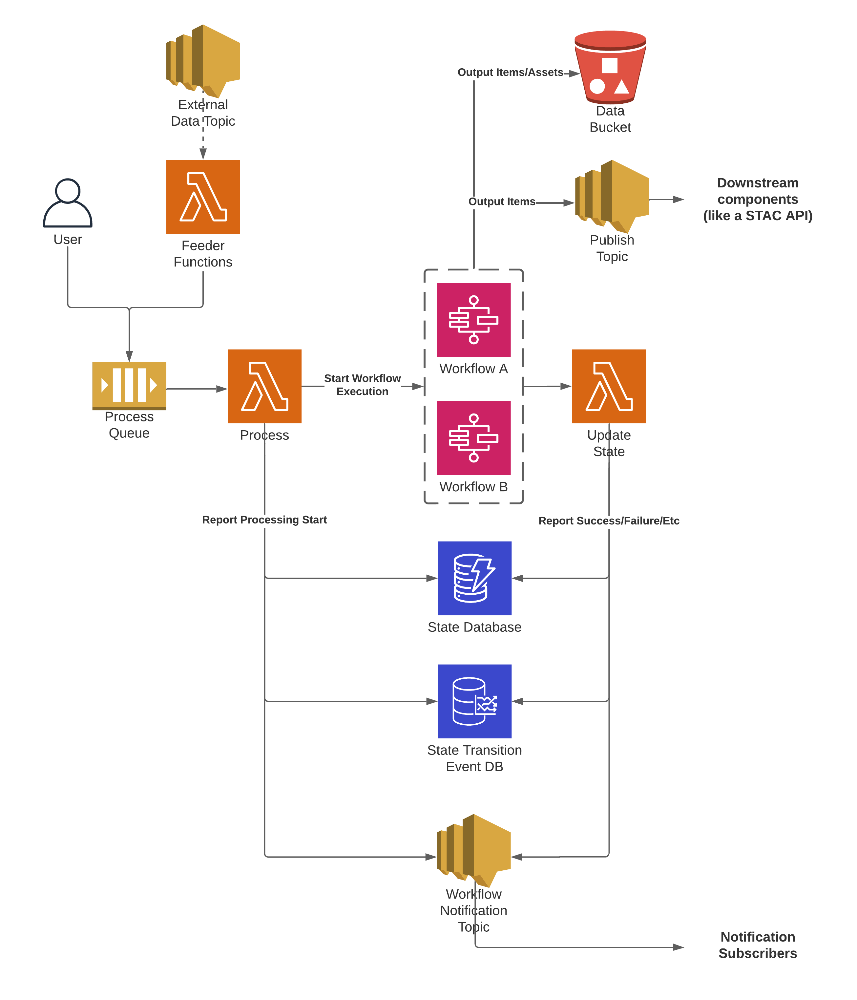

# Cirrus

[![build-status-image]][build-status]
[![coverage-status-image]][codecov]
[![pypi-version]][pypi]

Cirrus is a [STAC](https://stacspec.org/)-based geospatial processing pipeline platform,
implemented using a scalable architecture deployed on AWS. Cirrus provides the generic
infrastructure for processing, allowing a user to focus on implementing the specific
processing logic for their data.

As input, Cirrus takes a STAC ItemCollection along with a `process` definition block.
That input is called a "payload" and follows the `Payload` model defined in the
[**stac-task**](https://github.com/stac-utils/stac-task) package, with slightly tighter requirements on the presence and content
of the `process` definition block.

An input payload is run through a workflow that generates one or more output STAC Items.
These output Items are added to the Cirrus static STAC catalog in S3,
and are also broadcast via an SNS topic. Subscriptions to that topic can
trigger additional workflows or external processes, such as indexing into a
STAC API catalog (e.g.,
[stac-server](https://github.com/stac-utils/stac-server)).

Cirrus workflows range from the simple publishing of unmodified input items to the
complex transformation of input Items and generation of wholly-new output Items. The
current state of a payload in a processing pipeline is tracked in a state database to
prevent duplicate processing and allow for a user to follow the state of any input
payload through the pipeline.

As shown in this high-level overview of Cirrus, users input data to Cirrus
through the use of _feeders_. Feeders are simply programs that get/generate
some type of STAC metadata, combine it with processing parameters, and pass it
into Cirrus as a payload.

## Cirrus Development

If developing new code for cirrus-geo, checkout the [Contributing
Guide](CONTRIBUTING.md).

## Documentation

Documentation for deploying, using, and customizing Cirrus is contained
within the [docs](https://cirrus-geo.github.io/cirrus-geo/) directory:

- Learn how to [get
  started](https://cirrus-geo.github.io/cirrus-geo/stable/cirrus/10_intro.html)
- Understand the
  [architecture](https://cirrus-geo.github.io/cirrus-geo/stable/cirrus/20_arch.html)
  of Cirrus and key concepts
- [Use](https://cirrus-geo.github.io/cirrus-geo/stable/cirrus/30_payload.html)
  Cirrus to process input data and publish resulting STAC Items
- Cirrus features several [component
  types](https://cirrus-geo.github.io/cirrus-geo/stable/cirrus/60_components.html)
  that each represent a specific role within the Cirrus architecture

## About

Cirrus is an Open-Source pipeline for processing geospatial data in AWS.
Cirrus was developed by [Element 84](https://element84.com/) originally under a
[NASA ACCESS
project](https://earthdata.nasa.gov/esds/competitive-programs/access) called
[Community Tools for Analysis of NASA Earth Observation System Data in the
Cloud](https://earthdata.nasa.gov/esds/competitive-programs/access/eos-data-cloud).

[build-status-image]: https://github.com/cirrus-geo/cirrus-geo/actions/workflows/python-test.yml/badge.svg
[build-status]: https://github.com/cirrus-geo/cirrus-geo/actions/workflows/python-test.yml
[coverage-status-image]: https://img.shields.io/codecov/c/github/cirrus-geo/cirrus-geo/master.svg
[codecov]: https://codecov.io/github/cirrus-geo/cirrus-geo?branch=master
[pypi-version]: https://img.shields.io/pypi/v/cirrus-geo.svg
[pypi]: https://pypi.org/project/cirrus-geo/
