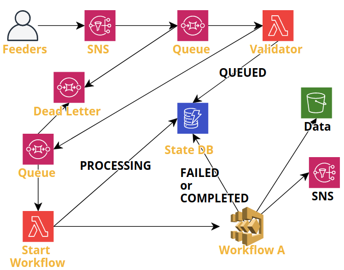
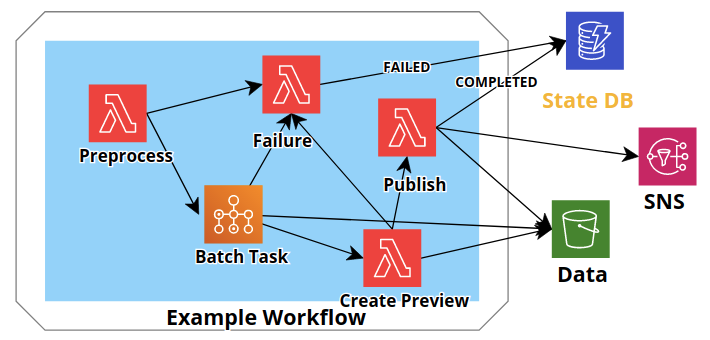

# Cirrus Architecture

This is the basic architecture for Cirrus, a pipeline to process and publish geospatial data based on the [SpatioTemporal Asset Catalog](https://stacspec.org/) (STAC) specification. Cirrus uses STAC metadata as the primary message throughout a workflow, from input to output. The input and output STAC is equivalent to a [single file STAC catalog](https://github.com/radiantearth/stac-spec/tree/master/extensions/single-file-stac) and contains all the information needed to process the data. The diagram below shows how users interact with Cirrus and what Cirrus outputs.


## Feeders

Users operate *feeders*, programs that create STAC input catalogs and add them to Cirrus. Feeders could be AWS Lambda or AWS Batch operations that are user-initiated or scheduled.  The most simple version of a *feeder* is simply passing a JSON payload from the users local computer. Feeders are responsible for generating proper STAC metadata for the desired workflow, providing information on the workflow to run along workflow specific parameters, as desired.

Cirrus feeders are the most likely component of Cirrus to be customized by a user. Several general use Lambda feeders are included with Cirrus:

- `feed-stac-api`: Query a specific STAC API for Items, create a Cirrus Input Catalog for each one and add to Cirrus with a user-specified processing parameters
- `feed-stac-test`: Subscribe to an SNS topic that published STAC Items and log the result (used to test subscriptions to an SNS topic that publishes STAC Items, such as this or some other instance of Cirrus). Useful as a template for creating new feeders.

### Batch feeders

The included feeders are all Lambdas, however they can also be run as Batch processes instead, if they require more time or storage that what a Lambda can provide. If the feeder accepts a `batch` parameter and it is set to `true`, the feeder will spawn a Batch process from the Lambda using the same Lambda function code and the same payload. The Lambda will then exit. See documentation for the indvidual feeders for more information on accepeted parameters.

If writing your own feeder and want to support Batch, see the `utils.submit_batch_job` function in `cirrus-lib`.

## Cirrus Pipeline

The Cirrus Geospatial Pipeline black cloud above consists of a series of AWS services that orchestrate and manage the flow of data through the system, as shown here:



From the standpoint of a user, who is using *feeders* to add data to Cirrus, the entrypoint is an SNS topic named `queue`. Feeders should publish Cirrus input catalogs using the [ARN](https://docs.aws.amazon.com/general/latest/gr/aws-arns-and-namespaces.html) of the Cirrus **Validation SNS** topic.

Any message published to the **Validation Queue** (AWS SQS), which is subsequently consumed by the `Validate` Lambda function. `Validate` performs these steps, in order:

1. Validate JSON
2. Assign unique `ID` using passed in Collections, Items, and desired workflow
3. Check StateDB if input exists and get current state
4. If `state` is `PROCESSING`, `QUEUED`, or `INVALID` do nothing
5. If `state` is `COMPLETED` do nothing, unless user has specified `replace`
6. Add input to StateDB and set state to `PROCESSING`
7. Add input JSON to s3 as a matter of record
8. Add input JSON to **Processing Queue**

If steps #1 - #6 fail, the message wil be added to the Dead Letter Queue. If step #7 or #8 fail (after the Input JSON is added to StateDB), then the state of that input will be set to `FAILED`.

The **Processing Queue** is consumed by the `Start Workflow` Lambda function. `Start Workflow` function does two things, in this order:

1. Invoke the correct AWS Step Function based on the specified `workflow` in the Input Catalog
2. Update the Input Catalog in the StateDB to `PROCESSING`

## Workflows

Cirrus workflows are AWS Step Functions and are made up of a series of Tasks. Tasks can be either AWS Lambda functions or AWS Batch operations. An example workflows is shown here:



This example workflow includes several tasks:

- `Preprocess`: Performs some pre-processing on the Cirrus Input Catalog metadata and pass to `Batch`.
- `Batch`: Runs an AWS Batch process that generates some data that is added to the s3 Data bucket. The STAC catalog is updates and passed to `Create Preview`
- `Create Preview`: Create a Preview Cloud-Optimized GeoTIFF from existing data and, optionally, a thumbnail image. Add these to the STAC Item assets and pass to `Publish`
- `Publish`: Add all resulting STAC Items to the s3 Data bucket (alongside any data if there is some), publish each STAC Item to the Cirrus `publish` SNS, and mark the Input Catalog as `COMPLETED`
- `Failure`: If any of the above fail, mark the Input Catalog as `FAILED`

## Tasks

Cirrus includes several tasks by default:

- `add-preview`: Generates a byte-scaled Cloud-Optimized GeoTIFF (COG) from an asset, copy to bucket and add new asset for preview. Optionally also generates a thumbnail from preview image
- `copy-assets`: Copies 1 or more assets from source to the Cirrus data bucket and updates STAC Asset URLs
- `convert-to-cogs`: Converts 1 or more assets of the source to Cloud-Optimized GeoTIFFs, copies to Cirrus data bucket and replaces assets with new COG assets
- `publish`: A Lambda function that takes the input STAC catalog and publishes all included STAC Items to s3 and to the Cirrus `publish` SNS topic.

### Batch Tasks

The included tasks are all Lambda functions, however if a workflow supports it they can optionally be run as a Batch task instead. This is useful if the processing requirements are too much for a Lambda (e.g., takes more than 15 minutes, requires more storage, etc.).

A task can also be written solely as a Batch task with no corresponding Lambda. These tasks should be maintained in a separate repository and be responsible for publishing a Docker image. The image should contain a Command Line Interface that accepts a URL argument and is responsible for fetching the input payload and uploading the output payload.

The Docker image URL is set in the [definition for the batch job](../batch/jobs.yml).

```python
import argparse
import sys
from boto3utils import s3

def handler(catalog):
    # task logic
    return catalog

def main():
    parser = argparse.ArgumentParser()
    parser.add_argument("url", help="s3 url to STAC Process Catalog")
    args = parser0.parse_args(sys.argv[1:])

    # fetch input catalog
    catalog = s3().read_json(args.url)

    # run a handler function containing the task logic
    catalog = handler(catalog)

    # upload return payload
    s3().upload_json(catalog, args.url)


if __name__ == "__main__":
    main()
```

## STAC

Cirrus uses [STAC ](https://stacspec.org/) as the message specification for geospatial data through the pipeline. At the end of every workflow Cirrus outputs 1 or more STAC Items to it's internal static STAC, saved in the s3 bucket s3://cirrus-<stage>-data-{randomID}. The STAC root catalog is located at s3://cirrus-<stage>-data-{randomID}/catalog.json. 

### Input Collections vs Output Collections

Any STAC Item published by Cirrus is required to be part of a STAC Collection. ~~These Collections need to be added to Cirrus before any STAC Items are published that use this Collection. To add a Collection to the Cirrus STAC invoke the Cirrus Lambda function `cirrus-<stage>-stac` with the STAC Collection JSON as the payload.~~ *STAC Lambda currently under development*

### External Collections

Any STAC Item that Cirrus outputs (publishes) needs to belong to a Collection that has been added to Cirrus. However in some workflows the source "Collection" is external to Cirrus. **Cirrus only needs to define Collections that it publishes to**. If a source Collection is external (whether an external STAC or not) then it does not need to be defined in Cirrus. A common use case is when ingesting data from another source, transforming those into STAC records and publishing as a new Collection in Cirrus.