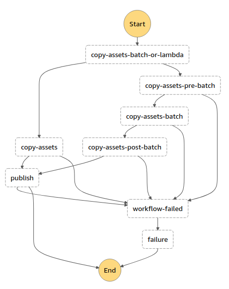

# Workflow Tutorial: mirror

In this tutorial the AWS CLI will be used, which can be installed via pip:

```
$ pip install awscli
```

The Cirrus `mirror` workflow is more complicated than [`publish-only`](tutorial-publish.md), not only because there is an additional task (`copy-assets`), it has an option for running it as a Lambda or running it as a Batch process.



The `copy-assets` task will copy specified assets from the source STAC Item(s), and upload them to the a specific s3 location. The `process` block for a `mirror` workflows looks like:

```json
{
    "workflow": "mirror",
    "output_options": {
        "path_template": "${collection}/${year}/${month}/${id}",
        "collections": {
            "my-collection": ".*"
        },
        "public_assets": ["thumbnail", "metadata", "info"]
    },
    "tasks": {
        "copy-assets": {
            "batch": false,
            "assets": ["thumbnail", "overview", "info", "metadata"],
            "drop_assets": ["WVP", "AOT", "visual"]
        }
    }
}
```

## Lambda vs Batch

Cirrus tasks can be implemented in a workflow as AWS Lambda functions, as AWS Batch jobs (Docker images), or as both where the user is given an option to run as a Lambda or as Batch. If there is an option the `batch` field for the task parameters is required.

In the above example `batch = false` which means that `copy-assets` will be run as a Lambda. In the workflow diagram above the Batch tasks (`copy-assets-pre-batch`, `copy-assets-batch`, and `copy-assets-post-batch`) will be skipped in lie of just running `copy-assets` as a Lambda function.

## Run the workflow

To run the example workflow:

- copy the [mirror example Input Catalog](examples/mirror.json) locally and name it `payload.json`
- get the ARN (Amazon Resource Name) for the SNS topic. In AWS Console navigate to SNS and look for topic named `cirrus-<stage>-queue`, where `<stage>` is the stage specified during deployment (defaults to `dev`). Copy provided ARN for that topic
- Run the following AWS command:

```
$ aws sns publish --topic-arn <queue-topic-arn> --message file://payload.json
```

If successful, the CLI will return JSON indicating a unique identifier for the message, you don't need to keep this.

## What happened?

Look at the `payload.json` file. Under `features` it has a single STAC Item for a Sentinel-2 scene. The `process`, shown above, indicates it:

- copies assets with keys "thumbnail", "overview", "info", and "metadata" to the Cirrus data bucket with the prefix `${collection}/${year}/${month}/${id}`, where the ${} keys represent fields from the STAC Item. The output STAC Item will reflect the new URLs to the uploaded assets.
- uploads all the assets as `public`, except for "overview" (as indicated by `output_options['public_assets']`)
- remove the assets "WVP", "AOT", and "visual" from the STAC Item

This is in addition to the `publish` task which:

- set collection on the Item to `my-collection`. The value `.*` is a regex expression used against the `id` of the Item. In this case all items are assigned the `my-collection` collection
- save output STAC Items in the data bucket using a templated path where the components are retrieved from the STAC Item. 
- Pass parameter `publish=true` to the `publish function (this will make the item publicly available over https from s3)

To verify operation, look at the contents of the `cirrus-<stage>-data-<random-string>` bucket:

```
$ aws s3 ls s3://cirrus-<stage>-data-<random-string>
```

which should show the STAC Item published:

```
s3://cirrus-<stage>-data-<random-string>/my-collection/2020/07/S2B_26PPC_20200728_0_L2A/S2B_26PPC_20200728_0_L2A.json
```

along with the assets that were copied, all under the `s3://cirrus-<stage>-data-<random-string>/my-collection/2020/07/S2B_26PPC_20200728_0_L2A/` prefix:

- preview.jpg
- L2A_PVI.tif
- tileInfo.json
- metadata.xml

The output STAC Item was also published to SNS, but if no subscription is set up it would not have been delivered anywhere. Use the AWS Console to also explore:

- Step Functions should indicate 1 execution in the `mirror` Step Function
- The `cirrus-<dev>-state` DynamoDB should show an Item where `cirrus_state` starts with `COMPLETED`, and the `id` starts with `mirror`
- The `/aws/lambda/cirrus-<stage>-publish` CloudWatch Log Group should contain logs for the publishing and will indicate the STAC Item being added to s3 and published to SNS

To set up a subscription to the SNS Publish Topic see the [publish tutorial](tutorial-publish.md).
