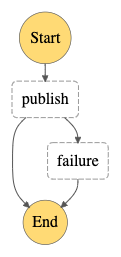

# Workflow Tutorial: publish-only

In this tutorial the AWS CLI will be used, which can be installed via pip:

```
$ pip install awscli
```

The Cirrus `publish-only` workflow only does one thing: it takes all the
Input STAC Items and "publishes" each one. If the publishing task is
successful then the workflow ends. If it fails it will invoke other error
handling tasks, as can be seen in the Step Function diagram:



In Cirrus publishing means:

- A message is published to the SNS topic `cirrus-<stage>-publish`
- The STAC Item is written to the s3 bucket named `cirrus-<stage>-data


## Run the workflow

To run the example workflow:

- Copy the [publish-only example Input Catalog](examples/publish-only.json)
  locally and name it `payload.json`.
- Get the ARN (Amazon Resource Name) for the SNS topic. In AWS Console navigate
  to SNS and look for topic named `cirrus-<stage>-process`, where `<stage>`
  is the stage specified during deployment (defaults to `dev`).
  Copy the ARN provided for that topic.
- Run the following AWS command:

```
$ aws sns publish --topic-arn <process-topic-arn> --message file://payload.json
```

If successful, the CLI will return JSON indicating a unique identifier for
the message; you don't need to keep this.


## What happened?

Look at the `payload.json` file. Under `features` it has a single STAC Item
for a Sentinel-2 scene. The `process` block looks like:

```json
{
    "workflow": "publish-only",
    "output_options": {
        "path_template": "${collection}/${year}/${month}/${id}",
        "collections": {
            "my-collection": ".*"
        }
    },
    "tasks": {
        "publish": {
            "public": true
        }
    }
}
```

In addition to specifying the `publish-only` workflow, this `process` block
says to:

- Set the collection on the Item to `my-collection`. The value `.*` is a
  regex expression used against the `id` of the Item. In this case all items
  are assigned the `my-collection` collection.
- Save the output STAC Items in the data bucket using a templated path where
  the components are retrieved from the STAC Item.
- Pass the parameter `publish=true` to the `publish function (this will make
  the item publicly available over https from s3).

To verify operation, look at the contents of the `cirrus-<stage>-data` bucket:

```
$ aws s3 ls s3://cirrus-<stage>-data
```

which should show the file published:

```
s3://cirrus-<stage>-data/my-collection/2020/07/S2B_26PPC_20200728_0_L2A/S2B_26PPC_20200728_0_L2A.json
```

The output STAC Item was also published to SNS, but without a subscription
on that topic, the message would not have been delivered anywhere.
Use the AWS Console to also explore:

- Step Functions should indicate one execution in the `publish-only` Step Function
- The `cirrus-<dev>-state` DynamoDB should show an Item where `updated_state`
  starts with `COMPLETED`
- The `/aws/lambda/cirrus-<stage>-publish` CloudWatch Log Group should contain
  logs for the publishing and will indicate the STAC Item being added to s3 and
  published to SNS


## Subscribe to Cirrus SNS Publish Topic

To verify that the STAC Item was published to the SNS `cirrus-<dev>-publish`
topic a subscription first needs to be set up. SNS does not save messages as
it is not a queue, so without a subscription message cannot be delivered anywhere
and are dropped.

Using the AWS Console set up an email subscription to the
`cirrus-<dev>-publish` topic, then publish the payload again:

```
$ aws sns publish --topic-arn <process-topic-arn> --message file://payload.json
```

It will appear to have been successfully run, however if you look at the number
of executions listed for the `publish-only` Step Function, you will see still
just one. This is because Cirrus checked the Input ProcessPayload and saw it
had already been run and that run completed successfully. We could either publish
a different STAC Item or indicate to Cirrus that it should replace the existing
Item. Let's do the latter by updating the `process` block in `payload.json`
with the `replace` field:

```json
{
    "workflow": "publish-only",
    "replace": true,
    "output_options": {
        "path_template": "${collection}/${year}/${month}/${id}",
        "collections": {
            "my-collection": ".*"
        }
    },
    "tasks": {
        "publish": {
            "public": true
        }
    }
}
```

Republish the message. Now a second exucution will be seen, and the published
message should have been delivered to the email used in the subscription.
Note that under normal operation it is not advisable to use email-based
subscriptions, as this can easily be overloaded and hit AWS limits.
Instead, the publish topic is useful for other service subscriptions,
such as an SQS Queue for a Lambda function.
